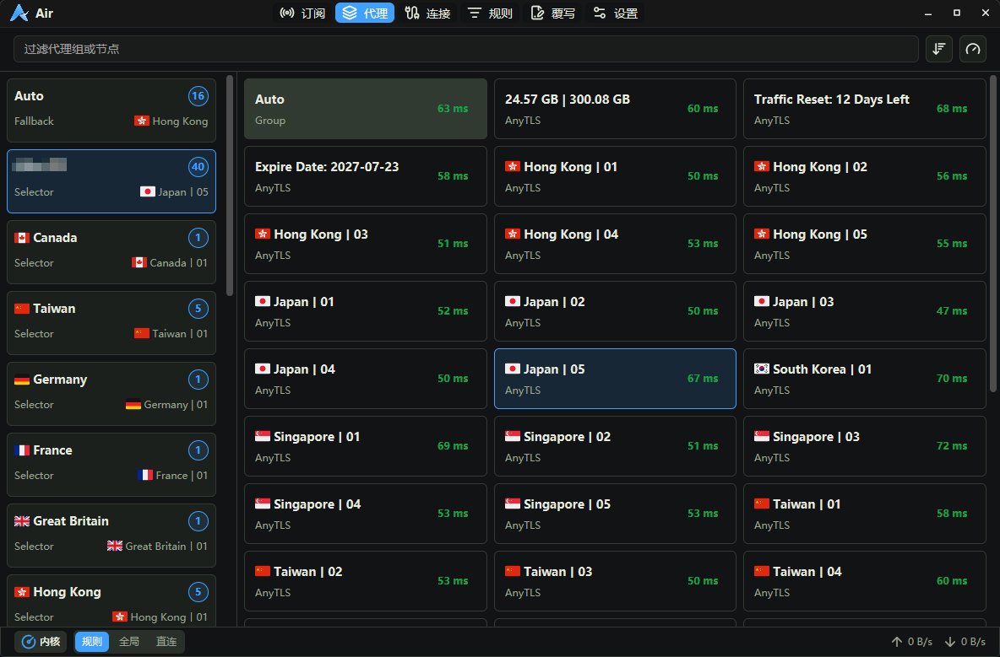

# Air

Air 是一个基于 Rust 的原生桌面 `mihomo` 可视化管理器，目标是提供接近 Clash Verge / FlClash 的管理体验，同时保持清晰的模块边界、较低的资源占用，以及对 `mihomo` 核心进程与 `external-controller` API 的直接控制。

当前项目已具备完整的主路径能力，主要开发与验证平台是 Windows；macOS / Linux 仍以基础可编译和部分降级能力为主。



## 当前能力

- 原生 GPUI 桌面界面，包含侧边导航、主题切换、状态栏、托盘事件和关闭到托盘。
- mihomo 核心准备、启动、停止、重启、健康检查，以及运行配置写出与热重载。
- 订阅源管理，支持 URL 导入、本地 YAML 导入、手动更新、到期更新、取消更新、排序、启用选择和缓存预览。
- 代理组离线展示与运行态选择，支持单节点测速、组测速和 `fixed` 组清理。
- 连接页实时监控，支持 WebSocket 流、手动刷新、筛选结果批量关闭和 Windows 进程图标缓存。
- 规则页读取 `/rules`，支持过滤和通过 `/rules/disable` 临时启停运行态规则。
- 设置页统一管理 `app.config.toml` 与常用 mihomo 配置。
- 覆写页编辑 `data/override.js`，并在写出运行配置前通过 QuickJS 执行覆写脚本。

## 当前边界

- 当前主路径是单配置架构：
  - 用户配置：`config/core.common.config.yaml`
  - 运行配置：`config/core.runtime.config.yaml`
- `core.runtime.config.yaml` 会在启动、保存配置、启用订阅或覆写脚本变化时重建，不应手工当作主配置维护。
- 运行态 API 返回的数据不会直接写回用户 YAML。
- YAML 保存会经过 `serde_yaml` 重新序列化，无法保留原始注释、锚点和排版。

已知限制：

- base64 节点订阅转换尚未实现，这类订阅会返回预留诊断。
- 系统通知、导入导出/备份恢复、诊断导出文档仍未补齐。
- Windows 是当前主要支持平台；macOS / Linux 的自启、托盘、TUN 权限、服务化和打包发布仍为降级或 `unsupported`。

## 技术栈

- Rust 2024 edition
- `gpui` / `gpui_platform`：直接使用 Zed 官方仓库源码依赖
- `gpui-component`：直接使用 `longbridge/gpui-component`
- `mihomo`：作为外部核心进程，通过配置文件和 `external-controller` API 交互
- `rquickjs`：执行运行配置覆写脚本

当前锁定依赖状态：

- `gpui` / `gpui_platform`：`zed-industries/zed`，`Cargo.lock` 当前解析到 `ee5c7b6d45faeccd40a285be63a853753c91eff0`
- `gpui-component`：`longbridge/gpui-component`，当前固定 `196b9259b562c26be97c92f88c798bbeefa9cb3d`

## 工作区结构

```text
crates/
  air-desktop/     # 最终桌面二进制、构建期 mihomo 下载、Windows 图标资源
  air-app/         # 应用装配、命令路由、事件总线、快照与后台任务
  air-ui/          # GPUI 视图、页面、组件、路由和 UI assets
  air-mihomo/      # mihomo 核心检测、生命周期、API 客户端和领域模型
  air-config/      # mihomo YAML 模型、解析、校验、合并和 override.js
  air-storage/     # 路径规划、原子写入、配置/订阅/覆写/设置存储
  air-platform/    # 托盘、自启、服务、提权、窗口等平台能力封装
  air-settings/    # app.config.toml 对应的纯模型
  air-telemetry/   # tracing、日志保留、内存采样和脱敏
  air-error/       # 统一错误类型
```

架构边界见 [docs/architecture.md](docs/architecture.md)。

## 构建要求

- 稳定版 Rust 工具链
- 可访问 Git 与 Cargo git 依赖
- 首次构建时可访问 GitHub Release

首次构建时，`crates/air-desktop/build.rs` 会为当前 target 下载对应的 `mihomo` 压缩包与常用 geodata，并缓存到仓库根目录下被忽略的 `mihomo/` 目录。运行时会再将这些资源释放到应用工作目录。

## 本地运行

```powershell
cargo fmt --check
cargo check
cargo test
cargo run -p air-desktop --bin air
```

如需强制重新下载构建期缓存的 `mihomo` / geodata：

```powershell
$env:AIR_FORCE_MIHOMO_DOWNLOAD = "1"
cargo check
```

## 运行期文件

应用通过 `ProjectDirs::from("org.air", "", "Air")` 解析平台目录，核心文件包括：

- `config/app.config.toml`
- `config/core.common.config.yaml`
- `config/core.runtime.config.yaml`
- `config/subscriptions/`
- `data/override.js`
- `data/logs/air.log`
- `data/logs/core.log`

其中：

- `app.config.toml` 保存 GUI 行为设置。
- `core.common.config.yaml` 是用户维护的主配置。
- `core.runtime.config.yaml` 是运行期生成文件。
- `override.js` 用于在最终写出 runtime 配置前做脚本覆写。

## 平台说明

Windows 已实现：

- 托盘菜单与关闭到托盘
- 当前用户自启动
- UAC 提权 helper
- TUN 场景下的内核服务安装、卸载、启动、停止
- 连接页进程图标缓存

macOS / Linux 当前仍缺少完整的：

- 托盘与系统通知
- 自启动
- TUN 权限处理
- 服务化托管
- 面向终端用户的打包发布流程

## CI / 发布现状

- GitHub Actions 当前在 Windows 上执行 `cargo fmt --check` 和 `cargo check`
- 当 `main` 分支收到新的 push 时，会自动构建并发布 Windows `air.exe` 压缩包

目前仓库尚未补齐跨平台发布链路和完整发布文档。

## 相关文档

- [docs/architecture.md](docs/architecture.md)
- [docs/mihomo-api.md](docs/mihomo-api.md)
- [docs/config.yaml](docs/config.yaml)
- [CONTRIBUTING.md](CONTRIBUTING.md)
- [SECURITY.md](SECURITY.md)

## 许可证

Air 使用 [MIT License](LICENSE)。

第三方声明见 [NOTICE.md](NOTICE.md)。

友情链接 [Linux.do](https://linux.do)